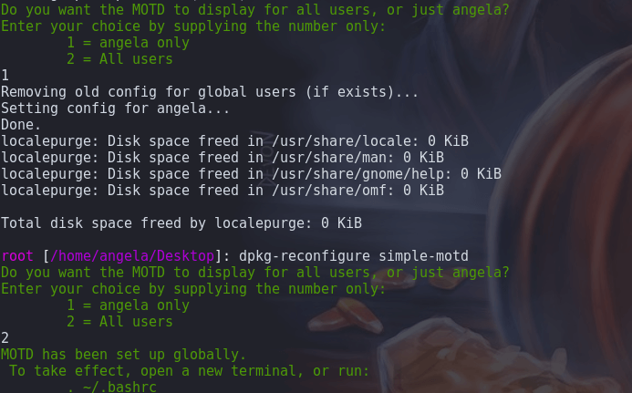

# Simple MOTD for Debian Desktop
Ubuntu-like "message of the day" screen for Debian desktop terminals, without the requirement of PAM


(terminal background not included)

## Features
- Prettify your terminal with ASCII art and informational statistics on each terminal launch
- Does not interfere with any system-based MOTD you may have set (/etc/motd)
- Display the MOTD only for your user, or every user on the system
- Not reliant on PAM or an SSH server (ideal for Debian-based desktop environments)

## Install
Download the latest .deb installer from the [releases](https://github.com/angela-d/simple-motd-for-debian-desktop/releases) page and run:
```bash
sudo apt install ./simple-motd.deb
```
in the directory you downloaded the .deb to.  (ie. `cd /tmp && sudo apt install ./simple-motd.deb`)

## Additional Users
If you add users to your system after Simple MOTD is installed and you want to utilize a MOTD for them, use dpkg to re-initialize:
```bash
sudo dpkg-reconfigure simple-motd
```


### Uninstall
```bash
sudo apt remove --purge simple-motd
```

***
Tested in Gnome and [Tilix](https://packages.debian.org/sid/tilix) terminals (the motd loads upon each new launch, without having to log out of your active desktop session).

Base code from [Ubuntu's](https://ubuntu.com) server motd
