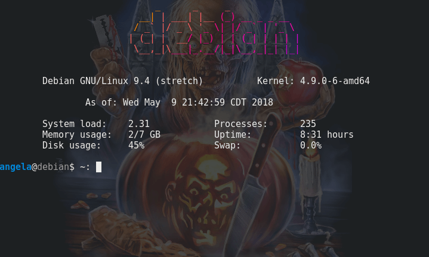

# Simple MOTD for Debian Desktop
Ubuntu-like "message of the day" screen for Debian desktop terminals, without the requirement of PAM

(Can be used in any Linux distro, but only tested in Debian)



(terminal background not included)

## Dependencies:
* Figlet: Displays the ascii art for what your hostname / custom banner reads

* Lolcat: Colors the ascii art in randomly generated colored gradients

## Install

### Vanilla Debian or Ubuntu
```bash
apt update && apt install figlet lolcat
```

### (optional) If using RVM:
```bash
apt update && apt install figlet
gem install lolcat
```

### Create the message of the day script
As the user you want to see the motd upon each terminal launch, run [ie. run the following command separately for root, user, user1 etc; if you want all accounts to have a motd]:
```bash
nano ~/.bashrc
```

and "link" to your MOTD script (replace /path/to/ with your location):
```bash
sh /path/to/motd.sh
```

Save & exit.

### Make the shell script executable:
```bash
chmod +x /path/to/motd.sh
```

### Finally, refresh your bashrc file without logging out:
```bash
. ~/.bashrc
```

to see your new message of the day.
***
### (optional) If you are using RVM, run `whereis lolcat` and replace the existing path, from:
```bash
LOLCAT=/usr/games/lolcat #whereis lolcat
```
to the location in your terminal:
```bash
LOLCAT=~/.rvm/gems/ruby-2.4.1/bin/lolcat
```

***
Tested in Gnome and [Tilix](https://packages.debian.org/sid/tilix) terminals (the motd loads upon each new launch, without having to log out of your active desktop session).

Base code from [Ubuntu's](https://ubuntu.com) server motd
