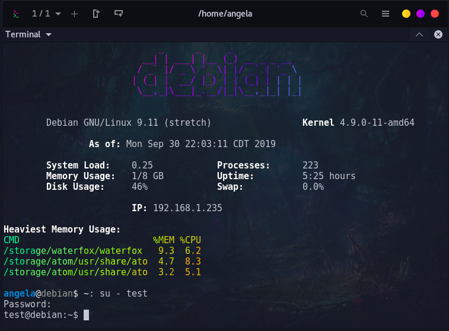
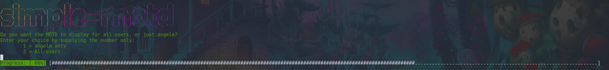
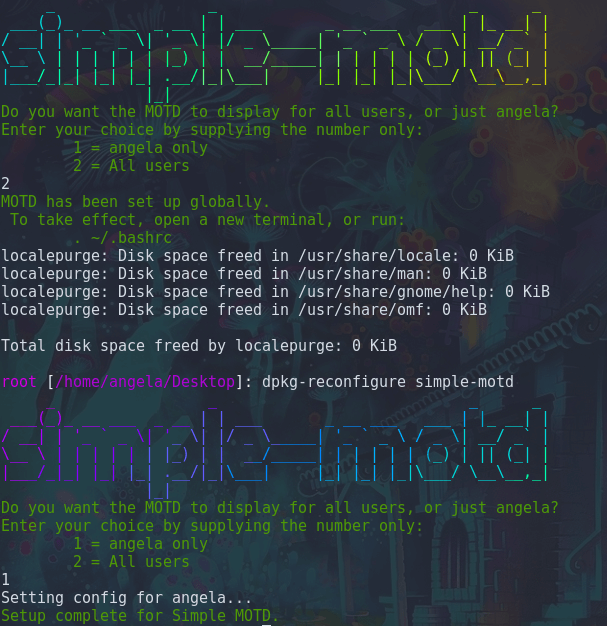

# Simple MOTD for Debian Desktop
Ubuntu-like "message of the day" screen for Debian desktop terminals, without the requirement of PAM




^ Single-user display mode (only angela is configured access -- test does not have the MOTD configured.)

## Features
- Prettify your terminal with ASCII art and informational statistics on each terminal launch
- Does not interfere with any system-based MOTD you may have set (/etc/motd)
- Display the MOTD only for your user, or every user on the system
- Not reliant on PAM or an SSH server (ideal for Debian-based desktop environments)



## Install
Clone the repo or download the latest .deb installer from the [releases](https://github.com/angela-d/simple-motd-for-debian-desktop/releases) page and run:
```bash
sudo apt install ./simple-motd.deb
```
in the directory you downloaded the .deb to.  (ie. `cd /tmp && sudo apt install ./simple-motd.deb`)

## Additional Users
Users that are added after installation will also be granted view of the MOTD (if you have 'All' configured)

**`su - root` being the exception. (User ID 0 is not issued a MOTD.)**

To change your configuration of who sees the MOTD:
```bash
sudo dpkg-reconfigure simple-motd
```


### Uninstall
```bash
sudo apt remove --purge simple-motd
```

***
Tested in Gnome and [Tilix](https://packages.debian.org/sid/tilix) terminals (the motd loads upon each new terminal launch, without having to log out of your active desktop session).

Original base code from [Ubuntu's](https://ubuntu.com) server motd
